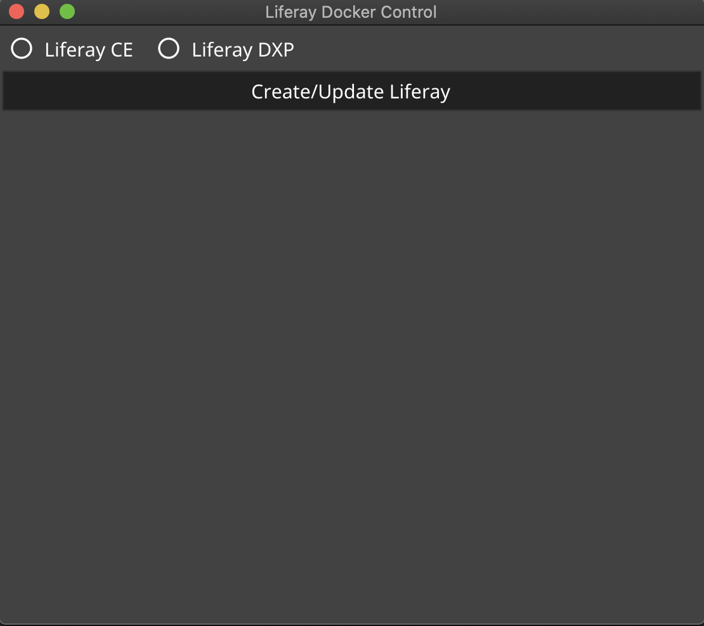

[](https://travis-ci.com/jeyvison/liferay-docker-control)
[](https://coveralls.io/github/jeyvison/liferay-docker-control?branch=master)

# Liferay Docker Control

Liferay docker control is  a go-based application that let's you download daily docker images of Liferay's latest master.
You can get the latest version from here: https://github.com/jeyvison/liferay-docker-control/releases/latest

## Requirements

For now you need two things:

- MacOS
- Docker

## Setup

You (obviously) need docker in order to run the images. You can get it here: https://www.docker.com/products/docker-desktop.

After you download and install it we should give at least 7 GB of RAM to Docker. To do that go to **Docker > Preferences > Resources > Memory**. 
Move the slider to 7 and then **Apply & Restart**

You can download the CE image freely but if you wanna download the DXP version you need two things:

- Be connected to the Recife's office local network or VPN
- Add the internal registry as **insecure** in the docker configurations


To add the internal registry to docker configuration you need to to the following:
- Go to **Docker > Preferences > Docker Engine**
- Paste the following json replacing the xxx with the ip:port addresss of the internal registry

```javascript
{
  "experimental": false,
  "debug": true,
  "insecure-registries": [
    "xxx.xxx.xxx.xxx:xxxx"
  ]
}
```
- As always, **Apply & Restart**


## How to use

It's pretty simple , check the image below:



You just have to select the version you want, click on the **Create/Update Liferay** button and that's it.
When the progress bar stops you can go to http://localhost:8080.


The application also offers a log file called **liferay-doccker-control.log** that is created in your user directory.


